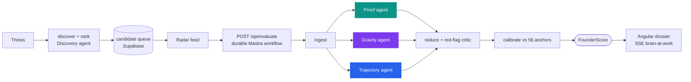
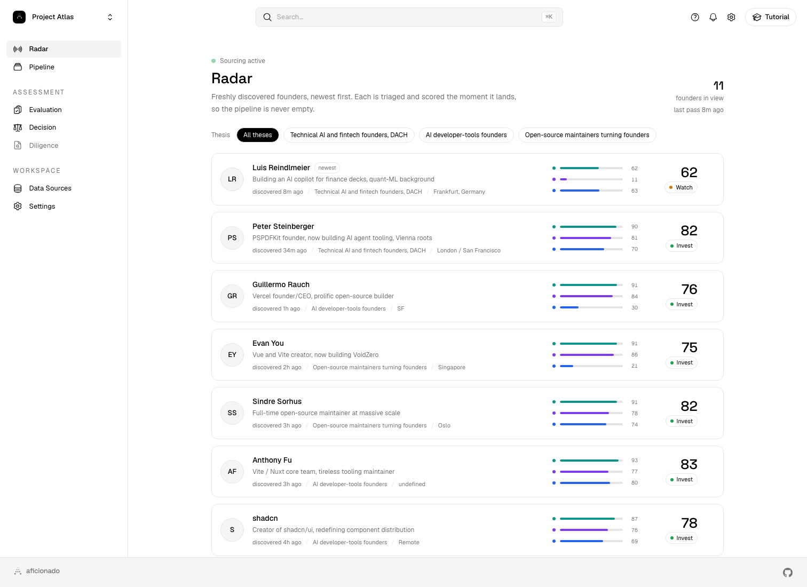
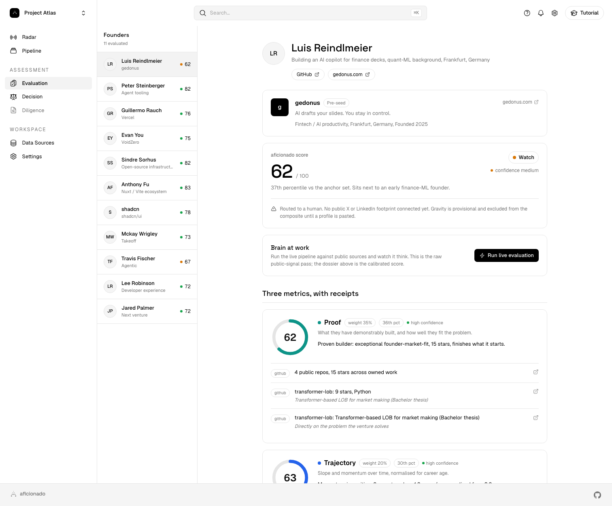

<div align="center">

<picture>
  <source media="(prefers-color-scheme: dark)" srcset="public/brand/aficionado-mark-inverse.svg">
  
</picture>

# aficionado

**An AI operating system for venture capital.**
Sources very-early-stage founders, scores the founder not the pitch, and streams an evidence backed verdict where every number is clickable to its source.


</div>

> "There are only good founders, not good companies." Carsten Maschmeyer

At pre-seed there is no revenue and no moat to underwrite, the only durable signal is the founder. aficionado makes that thesis measurable: it discovers founders from public data, scores each one on three metrics, and returns a calibrated Invest / Watch / Pass verdict. The agents gather the evidence, deterministic math makes the call, so every verdict is reproducible and testable.

## Setup

Requirements: Node 22.x (`.nvmrc` pins `22.23.0`) and pnpm.

```bash
nvm use
pnpm install
pnpm start        # SPA on the committed real-data snapshot, no keys, http://localhost:4200
```

The SPA runs fully standalone on the committed snapshot. To exercise the live streaming backend, run the Vercel dev server, which serves the SPA and the `/api` functions on one origin:

```bash
cp .env.example .env.local   # add OPENAI_API_KEY for real agents (absent = heuristic fallback)
vercel dev                   # SPA + /api together
```

Build and check:

```bash
pnpm run build                          # Angular build + typecheck -> dist/aficionado/browser
npx tsc -p api/tsconfig.json --noEmit   # typecheck the /api serverless functions
pnpm eval                               # calibration eval, locks the scoring math
```

Every environment variable is optional. Without keys the backend scores with a deterministic heuristic.

| Variable | Purpose |
| --- | --- |
| `OPENAI_API_KEY` | Runs every Mastra agent. Absent, the heuristic fallback takes over. |
| `GITHUB_TOKEN` | Raises the GitHub rate limit, 60/h to 5000/h. |
| `SERPAPI_KEY` | Enables the Google Patents connector. |
| `SUPABASE_URL`, `SUPABASE_SERVICE_ROLE_KEY` | Persist sourced candidates and cached dossiers. |
| `MASTRA_PLATFORM_ACCESS_TOKEN`, `MASTRA_PROJECT_ID` | Ship agent and tool traces to the Mastra dashboard. |

## The founder score

Three metrics, each scored 0 to 100, combined into one weighted composite.

| Metric | Weight | What it measures |
| --- | :---: | --- |
| **Proof** | 0.35 | What they have demonstrably built: shipped work, contribution weighted repo authority, package adoption, research depth, patents, community standing. |
| **Gravity** | 0.45 | Whether strong people, capital and attention move toward them: true reach, network authority, amplification. |
| **Trajectory** | 0.20 | Momentum: recent shipping cadence, acceleration, and longevity of the build history, normalised for career age. |

How the three become one number:

1. **Per-metric agents.** Each metric is scored by its own agent, which calls only that metric's connectors as tools and returns calibrated features, never the final number. No LLM math leaks into the composite.
2. **Confidence gate.** Confidence is evidence completeness times cross-source agreement. A low-confidence metric is **excluded** from the composite and flagged, not guessed. Thin profiles route to a human.
3. **Weighted composite.** The trusted metrics combine at the default **Maschmeyer preset** (Proof 0.35 / Gravity 0.45 / Trajectory 0.20), the attract-and-sell lens. The Settings sliders re-rank the whole pipeline live.
4. **Red-flag gate.** A skeptical critic can only **cap** the score, one high flag caps it at 55, so pitch cannot outrun proof.
5. **Calibration.** The result is banded Invest (>= 70) / Watch (>= 48) / Pass, then turned into a percentile against a **56-founder anchor set** of real founders who succeeded, went mixed, or failed ("37th percentile, sits next to X").
6. **Receipts.** Every number is clickable down to the exact commit, package, paper, patent, or launch it came from.

The same `src/app/core/scoring.ts` runs in the seed generator, the live UI re-rank, and the backend reducer. `pnpm eval` (Vitest plus a Mastra scorer) locks 14 calibration cases, so the numbers cannot silently drift.

## Architecture

Two loops around one deterministic scoring core.



- **Loop A, sourcing.** A daily Vercel cron hits `/api/sourcing`, and an hourly GitHub Action discovers and evaluates net-new founders. Both run the Mastra sourcing workflow (discover, then a discovery agent ranks thesis matches) and persist to Supabase.
- **Loop B, evaluation.** `/api/evaluate` runs a durable Mastra workflow: three metric agents gather evidence in parallel, a deterministic reducer plus a red-flag critic turn it into a score, calibration runs last, and every step streams to the UI as Server-Sent Events.
- **One connector registry, two surfaces.** Every source is described once in `src/app/core/connectors/descriptors.ts`, which drives both the Data sources UI and the agent toolset. The type contract is isomorphic (no Node or browser deps), so client, backend, and a future MCP surface share it. Live connectors: **GitHub, npm, PyPI, arXiv, Semantic Scholar, OpenAlex, Google Patents, Stack Exchange, Wayback**, keyless where possible.

## Honest self-demo

The system evaluates its own author end to end. Luis Reindlmeier, co-founder of GEDONUS (an AI slide add-in for finance), is genuinely discovered under the DACH AI/fintech thesis and scored from real GitHub evidence: **Proof 62** (a transformer limit-order-book thesis repo sits almost on top of the problem GEDONUS solves), **Trajectory 63**, and **Gravity 11 at low confidence, excluded** from the composite instead of dragging it down. Result: **composite 62, Watch, 37th percentile**, routed to a human pending a social profile. That honest read, strong but incomplete, is the point.

## Screenshots

| Radar, always-on sourcing | Evaluation dossier with receipts |
| --- | --- |
|  |  |

## Stack

- **Angular 22**, standalone components, signals, zoneless change detection, a static SPA.
- **Tailwind CSS v4** with semantic tokens.
- **Mastra** (`@mastra/core`) orchestration: connectors as tools, three scoped metric agents plus a red-flag critic and a discovery agent, both loops as durable workflows. Every agent runs OpenAI `gpt-5.5`, spans traced to the Mastra Platform, deterministic heuristic fallback when no key is present.
- **Vercel Functions** (Node 22, ESM) for the `/api` backend, plus an hourly GitHub Action for the heavier refresh.
- **Supabase** (Postgres, RLS, pgvector) for the candidate queue and cached dossiers, optional. With no keys the app runs on the committed real-data snapshot.

## Docs

`ARCHITECTURE.md` for the system in depth, `docs/SCORING.md` for the full math, `docs/CONNECTORS.md` for the registry, `DECISIONS.md` for why it is built this way, and `SETUP.md` for keys and deployment.
